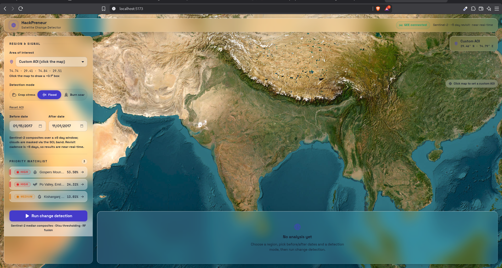

# GeoVision AI 🛰️

> AI-powered satellite change detection — analyze any region on Earth across any time window using Google Earth Engine.

GeoVision AI is a full-stack geospatial intelligence platform that detects and visualises land-cover changes (flooding, deforestation, urban growth, disaster impact) from multispectral satellite imagery. Draw an area of interest on the map, pick two date windows, and the pipeline returns spectral-difference maps, change statistics, and an AI-generated narrative — in seconds.

---

## Features

- 🗺️ **Interactive AOI Selection** — Draw or paste any polygon / bounding-box on a Leaflet map; the backend validates size and fetches optimal imagery automatically.
- 📡 **Google Earth Engine Integration** — Fetches Sentinel-2 / Landsat composites, computes NDVI / NDWI / SWIR indices, and returns cloud-masked mosaics.
- ⚡ **Smart Caching** — Two-tier cache (in-memory session cache + on-disk preset cache) eliminates redundant GEE calls for repeated or preset requests.
- 🤖 **AI Narrative Generation** — GPT-powered natural-language summaries explain detected changes in plain English.
- 📊 **Change Statistics** — Pixel-level change magnitude, affected area (km²), and per-class breakdowns returned alongside map tiles.
- 📋 **Watchlist** — Save and monitor named AOIs; re-run analysis with one click and compare results over time.
- 🏷️ **Preset Events** — Bundled historical disaster presets (Pakistan Floods 2022, Bihar Floods 2017, …) for instant demo analysis.
- 🌙 **Dark-mode UI** — Space Grotesk / JetBrains Mono typography, fully responsive React + Vite frontend.

---

## Demo



[](./media/video.mp4)

### 🎥 Demo Video

[Watch the full walkthrough](./media/video.mp4)

---

## Architecture

```
┌─────────────────────────────────────────────────────────┐
│                      Frontend (Vite + React)            │
│  Leaflet map · AOI drawing · Results overlay · Watchlist│
└───────────────────────┬─────────────────────────────────┘
                        │  HTTP / REST  (port 5173 → 8000)
┌───────────────────────▼─────────────────────────────────┐
│                FastAPI Backend  (Uvicorn)                │
│                                                         │
│  POST /analyze ──► pipeline/                            │
│    ├── gee_client.py   (GEE auth & connectivity check)  │
│    ├── pipeline/       (fetch → mask → diff → stats)    │
│    ├── cache.py        (disk preset + session LRU)      │
│    ├── geocoder.py     (place-name → bbox resolution)   │
│    ├── messages.py     (AI narrative generation)        │
│    └── watchlist.py    (saved AOI persistence)          │
│                                                         │
│  External: Google Earth Engine API · OpenAI API         │
└─────────────────────────────────────────────────────────┘
```

### Tech Stack

| Layer | Technology |
|-------|-----------|
| Frontend | React 18, Vite, Leaflet / react-leaflet, Phosphor Icons |
| Fonts | Space Grotesk (variable), JetBrains Mono (variable) |
| Backend | FastAPI, Uvicorn, Pydantic v2 |
| Geospatial | Google Earth Engine API (`earthengine-api`), geemap |
| Analysis | NumPy, Pandas, scikit-learn, scikit-image, Pillow |
| AI | OpenAI GPT (narrative generation) |

---

## Getting Started

### Prerequisites

- Python ≥ 3.10
- Node.js ≥ 18
- A Google Earth Engine project with service-account credentials
- (Optional) OpenAI API key for AI narratives

### Backend

```bash
cd backend
python -m venv ../venv && source ../venv/bin/activate
pip install -r requirements.txt

# Authenticate GEE (first run)
earthengine authenticate

uvicorn backend.main:app --reload --port 8000
```

### Frontend

```bash
cd frontend
npm install
npm run dev          # starts Vite dev server on http://localhost:5173
```

---

## Project Structure

```
Geovision-AI/
├── backend/
│   ├── main.py              # FastAPI entrypoint
│   ├── pipeline/            # Core change-detection pipeline
│   ├── models/              # Pydantic schemas
│   ├── gee_client.py        # GEE init & connectivity helpers
│   ├── cache.py             # Two-tier caching layer
│   ├── geocoder.py          # Place → bbox resolution
│   ├── messages.py          # AI narrative generation
│   └── watchlist.py         # Saved AOI management
├── frontend/
│   └── src/
│       ├── App.jsx
│       ├── components/      # Map, sidebar, results, watchlist UI
│       ├── api/             # Axios wrappers
│       └── styles/
├── media/
│   ├── image.png            # Demo screenshot
│   └── video.mp4            # Full walkthrough video
└── sample_events/           # Preset disaster event configs
```

---

## License

MIT © 2026 GeoVision AI contributors
